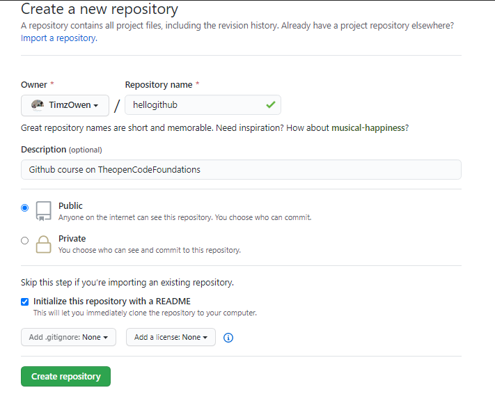

   

# Introduction to Git version Control

**GitHub** is a code hosting platform for _version control_ and _collaboration_.  
It lets you and others work together on projects from anywhere.

We will have a look at some essentials like repositories, branches, commits, and Pull Requests.  
You’ll create your own Hello World repository and learn GitHub’s Pull Request workflow, a popular way to create and review code.
You’ll learn how to:  

1. Create and use a repository.  
2. Start and manage a new branch. 
3. Make changes to a file and push them to GitHub as commits.  
4. Open and merge a pull request.  

### 1. To create a new repository
___________
- In the upper right corner, next to your avatar or identicon, click  and then select New repository.
- Name your repository `hello-world`.
- Write a short description.
- Select Initialize this repository with a README.  

### 2. Branching  
___________
It is a way to work on different versions of a repository at one time.   
By default your repository has one branch named `master` which is considered to be the definitive branch. 
We use branches to experiment and make edits before committing them to `master`.

When you create a branch off the master branch, _you’re making a copy, or snapshot_, of master as it was at that point in time. 
If someone else made changes to the master branch while you were working on your branch, you could pull in those updates.

### 3. Make and commit changes  
___________
- Click the `README.md` file.
- Click the  pencil icon in the upper right corner of the file view to edit.
- In the editor, write a bit about yourself.
- Write a commit message that describes your changes.
- Click `Commit` changes button.  

### 4. PRs (Pull Requests) & Commits 
___________
PRs are the heart of collaboration on GitHub. 
When you open a pull request, you’re proposing your changes and requesting that someone review and pull in your contribution and merge them into their branch. 
PRs show diffs, of the content from both branches. 
The changes, additions, and subtractions are shown in green and red.

As soon as you make a commit, you can open a pull request and start a discussion, even before the code is finished.

By using GitHub’s `@mention` system in your pull request message, you can ask for feedback from specific people or teams, whether they’re down the hall or 10 time zones away.

You can even open pull requests in your own repository and merge them yourself. It’s a great way to learn the GitHub flow before working on larger projects.

### Wanna make things easier? Why not. Here's the legendary tool for that. 
[GitKraken](http://gitkraken.com)
 


### On the terminal side;;

### Step 1. Create a repository on github;
after signing in, on the top right corner click  the __+__ sign to allow you to create a new repository.



## Git at Command

### Step 2.Clone your repository
_________________
Navigate to your current directory and open your file on an Editor
```
    cd myfiles

```
once you are on your IDE, then open a terminal or __Gitbash here__ and clone your repository
```
    git clone urlLinkHere
    git clone git clone https://github.com/TimzOwen/newRepoCreated

```

We are using a sample repo to demonstrate how it is done. now place your github url as it appears
on the page.What **GitClone** does is to create a copy of your repository on your local computer.

upon running the gitclone, you may encounter a final result/output like this:
```
    Cloning into 'new-repo'...
    remote: Counting objects: 5, done.
    remote: Compressing objects: 100% (4/4), done.
    remote: Total 5 (delta 0), reused 0 (delta 0), pack-reused 0
    Unpacking objects: 100% (5/5), done.
    Checking connectivity... done.

```

This means you have successfully cloned the exact repo on your local PC.

## Tracking changes with Git.
________________
### Step 3. Edit your file and Lets see the changes

Make the necessary changes in your file. you can give some acomplishments you have achieved or tell us more 
about you as a developer. Then go back to the terminal window:

```
    git init
    git status

```
This command tells us more about the recent changes made to the file.For our case it will indicate that we modified the README.md file and highlight it in red color.
To add the changes made to our repo, we have to type the following commands
__git inti__ initializes a .git to enable you to work on git commands

```
    git add
    git commit

```

___ git add . __  and __git commit -m "commit message__ means we are adding all file changes and then writing the changes we made on a commit message respectively.
Git add moves the files to a **staging** area. Git commit now makes them permanent of the current state.

```
    git add .
    git commit -m "edited my readme"
```
______________
### Step 4. Pushing changes to github.

```
    git push
    git push -u origin master
    git push remote origin urlTopushTo
    
```
The above terminal commands play a big role in making a copy of your project from your __local PC__ TO
__your git repo__ .

pushing to the master makes changes to the root brach. its advisable to make small changes not on the master branch.


